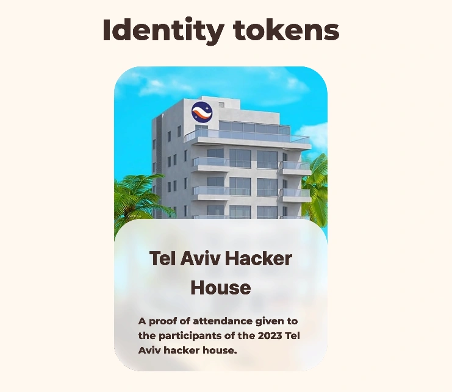

<h1 align="center">
   
  
   
  SBT Maker
</h1>

<h4 align="center">👷 Create your own SBT in 30 seconds</h4>

## What is a SBT?

A SBT is a non transferable token. It can be used to represent something about you of what you did. For example if you participated to the Tel Aviv Starknet hacker house of 2023 you may have claimed your POAP, that you can showcase on your starknet.id profile.

## Who is it for?

If you are organizing an event and want to reward the participants, you can use this simple tool. It will ask you to chose a password and a maximum date of mint. Share this password to your participants so they can mint their SBT. Even if someone looks at the chain transactions, if he doesn't know the password, he won't be able to mint one.
